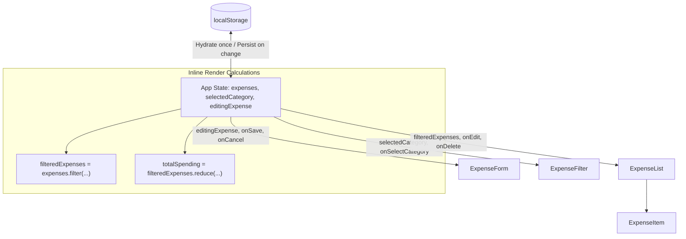

# Expense Tracker - Revised Architecture & Implementation Plan

A straightforward, minimal React single-page application built with Vite and Vanilla CSS. The app prioritizes simplicity, readability, and idiomatic baseline React practices without premature abstractions or optimizations.

---

## 1. Expense Data Model

Every expense record strictly adheres to the following shape:

```javascript
{
  id: string,          // Unique identifier generated via crypto.randomUUID()
  amount: number,      // Numerical monetary value (e.g. 42.50)
  description: string, // User description of the purchase
  category: string,    // Selected category string (e.g. "Food")
  date: string         // Date in "YYYY-MM-DD" format
}
```

---

## 2. Core Architectural Principles (Per Feedback)

* **No Premature Optimizations**: No `useMemo` or `useCallback`. Derived values (`filteredExpenses`, `totalSpending`) are calculated directly inline during each render cycle with standard JavaScript array methods (`filter`, `reduce`).
* **Zero Abstraction Bloat**: No Redux, React Context, custom hooks, services, or repository layers. Everything relies on standard `useState` and `useEffect` directly inside `App.jsx`.
* **Simple Category Definitions**: Categories defined as a plain array constant (`CATEGORIES`), keeping organization lightweight without extra architectural layers.
* **Single State Orchestrator**: `App.jsx` manages the entire state lifecycle:
  * `expenses` (array of expense items, initialized from `localStorage`)
  * `selectedCategory` (string, defaults to `'All'`)
  * `editingExpense` (`null` or the expense object being edited)
  * Direct `useEffect` syncing `expenses` to `localStorage` on change.

---

## 3. Revised Project Structure

```text
Antigravity-Expense-Tracker/
├── index.html
├── package.json
├── vite.config.js
├── project_plan.md          # Project architecture and implementation plan
├── src/
│   ├── main.jsx
│   ├── App.jsx                 # State, CRUD handlers, derived values & layout
│   ├── index.css               # Global theme tokens, typography & base resets
│   ├── App.css                 # Layout, form, filter, and item styles
│   └── components/
│       ├── ExpenseForm.jsx      # Form handling both Add and Edit
│       ├── ExpenseFilter.jsx    # Category filter pills/dropdown
│       ├── ExpenseList.jsx      # List view and empty state
│       └── ExpenseItem.jsx      # Individual expense card with Edit/Delete
```

> [!NOTE]
> `CATEGORIES` (e.g., `['Food', 'Transportation', 'Housing', 'Utilities', 'Entertainment', 'Healthcare', 'Other']`) can live as a simple shared constant in `src/categories.js` or directly inside `App.jsx`.

---

## 4. Main Components & Responsibilities

1. **`App.jsx` (State & CRUD Orchestrator)**:
   * **State**:
     * `expenses`: `useState(() => JSON.parse(localStorage.getItem('expenses') || '[]'))`
     * `selectedCategory`: `useState('All')`
     * `editingExpense`: `useState(null)`
   * **Persistence**:
     * `useEffect(() => { localStorage.setItem('expenses', JSON.stringify(expenses)); }, [expenses])`
   * **Derived Values (Inline, No `useMemo`)**:
     * `const filteredExpenses = selectedCategory === 'All' ? expenses : expenses.filter(e => e.category === selectedCategory);`
     * `const totalSpending = filteredExpenses.reduce((sum, item) => sum + item.amount, 0);` (and/or total for all expenses)
   * **CRUD Handlers**:
     * `addExpense(newExpense)`: prepends `{ ...newExpense, id: crypto.randomUUID(), amount: Number(newExpense.amount) }`
     * `updateExpense(updatedExpense)`: maps over `expenses` replacing the item where `item.id === updatedExpense.id`, then resets `editingExpense` to `null`
     * `deleteExpense(id)`: filters out the matching item; resets `editingExpense` if deleting the item currently in edit mode
     * `startEditing(expense)` / `cancelEditing()`: sets or clears `editingExpense`

2. **`ExpenseForm.jsx`**:
   * Controlled form for `amount`, `description`, `category`, and `date`.
   * Accepts `onSubmit` and `editingExpense` (with optional `onCancel`).
   * When `editingExpense` changes, resets form fields to match that expense; otherwise resets to defaults.
   * Basic validation (amount > 0, non-empty description, valid date, category selected).

3. **`ExpenseFilter.jsx`**:
   * Renders filter options ("All" + categories).
   * Receives `selectedCategory` and `onSelectCategory` callback.

4. **`ExpenseList.jsx` & `ExpenseItem.jsx`**:
   * `ExpenseList`: Iterates over `filteredExpenses` and renders `ExpenseItem` elements, or an empty state message if length is 0.
   * `ExpenseItem`: Displays formatted currency, date, category tag, and description. Provides "Edit" and "Delete" buttons triggering callbacks.

---

## 5. Data Flow Diagram



---

## 6. Implementation Steps in Order

1. **Step 1: Setup Project**:
   * Initialize clean Vite + React app in the workspace (`npx -y create-vite@latest ./ --template react`).
   * Verify dev server runs cleanly.
2. **Step 2: Base Styling (`index.css`, `App.css`)**:
   * Set up clean CSS variables for colors, typography, card surfaces, and responsive layout.
3. **Step 3: Component Implementation**:
   * Implement `ExpenseForm.jsx` (Add & Edit support with controlled inputs).
   * Implement `ExpenseFilter.jsx` (Category selector).
   * Implement `ExpenseItem.jsx` & `ExpenseList.jsx` (Display, empty state, action buttons).
4. **Step 4: State Orchestration in `App.jsx`**:
   * Wire `useState`, `useEffect` for `localStorage`, inline derived values, and CRUD handlers.
   * Render the total spending summary, filter, form, and list.
5. **Step 5: Verification & Testing**:
   * Verify adding, editing, deleting, category filtering, persistence across page reloads, and responsive layout.
